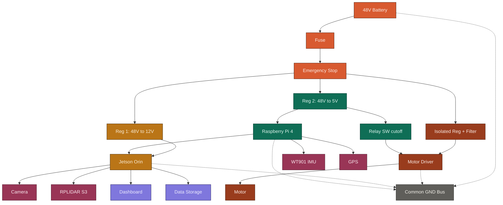

# Smart EV Explorer — System Diagram v2 (Mermaid)

Paste only the code between the triple backticks into your GitHub `README.md`. GitHub renders it automatically.

### Legend
- Orange — power generation and safety cutoffs (battery, fuse, emergency stop)
- Dark red/coral — motor branch (isolated supply, driver, motor)
- Amber — 12V rail and Jetson
- Teal — 5V rail, Raspberry Pi 4, and the software relay cutoff
- Pink — sensors (camera, LiDAR, IMU, GPS)
- Light purple — dashboard and data storage
- Gray — common ground bus (dashed = ground returns)

### Notes
- This is the updated v2 architecture: Raspberry Pi 4 in place of the Arduino Mega, plus the motor driver, camera, GPS, dashboard, and storage.
- It's a logical block diagram, not a true schematic — good for a README or portfolio page, not a substitute for your KiCad or hand-drawn circuit schematic.
- Recolor any group by editing its `classDef` hex values at the bottom.
